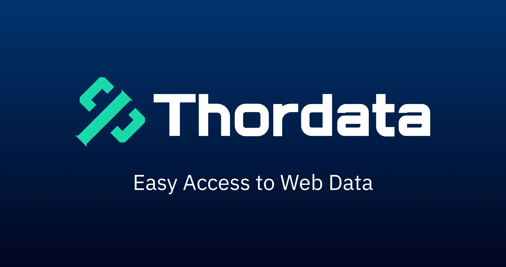

<p align="center">
  
</p>
<h1 align="center" style="border-bottom: none;">
  Thordata MCP Server
</h1>

<p align="center">
  <em>Built on a 195+ country proxy network, Thordata MCP breaks through web data barriers, delivering pure, structured, globally unlimited real-time information streams to AI models</em>
</p>

<div align="center">


[](LICENSE)
[](https://smithery.ai/server/@xja1023789-collab/scrapermcp_el)

<br/>


</div>

---

## 📖 Overview

ScraperMCP server seamlessly bridges AI and web ecosystems, providing one-click access to any website worldwide, real-time JavaScript rendering, intelligent anti-crawling mechanism bypass, and outputting AI-ready structured data content.

## 🛠️ MCP Tools

Thordata MCP supports dual-channel data acquisition through unlocker and regular proxies, fully compatible with multiple data formats including MarkDown, HTML, and Links.

### Web Scraper API Tool

Thordata MCP provides the parse_with_ai_selectors tool, leveraging Thordata Web Scraper API to implement intelligent scraping of any website.

## ✅ Prerequisites

Before deployment, please ensure you have:

- **Thordata Web Scraper API Account**: Visit [thordata](https://www.thordata.com/) to obtain your exclusive username and password;

## 📦 Configuration

### Installing via Smithery

To install scrapermcp_el automatically via [Smithery](https://smithery.ai/server/@xja1023789-collab/scrapermcp_el):

```bash
npx -y @smithery/cli install @xja1023789-collab/scrapermcp_el
```

### Environment Variables

Thordata MCP server supports the following environment variable configurations:

| Name                       | Description                                   | Default Value |
|----------------------------|-----------------------------------------------|---------------|
| `UNLOCKER_PROXY_LOGIN`     | Unlocker username                             |               |
| `UNLOCKER_PROXY_PASSWORD`  | Unlocker password                             |               |
| `UNLOCKER_PROXY_URL`       | Unlocker proxy address                        |               |
| `DEFAULT_PROXY_LOGIN`      | Regular proxy username                        |               |
| `DEFAULT_PROXY_PASSWORD`   | Regular proxy password                        |               |
| `DEFAULT_PROXY_URL`        | Regular proxy address                         |               |

### Using uv Configuration

- Install uv package manager:
  ```bash
  # macOS and Linux
  curl -LsSf https://astral.sh/uv/install.sh | sh
  ```
  Or:
  ```bash
  # Windows
  powershell -ExecutionPolicy ByPass -c "irm https://astral.sh/uv/install.ps1 | iex"
  ```

- Use the following configuration:
  ```json
  {
  "mcpServers": {
    "Scraper": {
      "command": "uv",
      "args": [
        "--directory",
        "<absolute folder path>", # e.g., D:\\ScraperMcp
        "run",
        "Scraper.py"
      ]
    }
  }
}
  ```

### Startup Command
fastmcp run Scraper.py:mcp

### 🖥️ Manual Setup Guide

#### Claude Desktop Configuration
1. Open Claude application
2. Navigate to **Settings → Developer → Edit Configuration**
3. Add the above configuration to the `claude_desktop_config.json` file

#### Cursor AI Configuration  
1. Open Cursor editor
2. Navigate to **Settings → Cursor Settings → MCP**
3. Click **Add New Global MCP Server**
4. Configure corresponding parameters

#### Cline Configuration
1. Open Cline settings
2. Navigate to **MCP Server Settings → Installed**
3. Click **Configure MCP Server**
4. Configure corresponding parameters

### Manual Setup: Cline Settings → MCP Server Settings → Installed → Click Configure MCP Server and configure corresponding parameters

## 🛡️ License

Open source distribution under MIT License - see [LICENSE](LICENSE) file for details.

---

## About Thordata

Thordata, as a market-leading web intelligence collection platform, adheres to the highest business ethics and compliance standards, empowering global enterprises to uncover data-driven business insights.

<div align="center">
<sub>
  Made by <a href="https://www.thordata.com/">Thordata</a>, if MCP saves you valuable time, we invite you to give ⭐ support.
</sub>
</div>

## ✨ Core Features

<details>
<summary><strong>Global Website Content Scraping</strong></summary>
<br>

- Supports data extraction from any URL, including complex single-page applications
- Complete JavaScript rendering capability, ensuring perfect presentation of dynamic content
- Flexible rendering mode selection: full JS rendering, pure HTML, or no rendering

</details>

<details>
<summary><strong>Intelligent AI Data Preprocessing</strong></summary>
<br>

- Automated HTML cleaning and conversion to highly readable Markdown
- Intelligent extraction of valid and usable links, optimizing data structure
- Native HTML format support, maintaining data integrity

</details>

<details>
<summary><strong>Global Network Barrier-Free Access</strong></summary>
<br>

- Efficiently bypasses complex anti-crawling protection systems
- Stable scraping of high-difficulty website content
- 195+ country IP pool automatic rotation, breaking geographical restrictions

</details>

<details>
<summary><strong>Cross-Platform Flexible Deployment</strong></summary>
<br>

- Customizable rendering and parsing parameter configuration
- Seamless integration with AI models and analysis tools
- Full support for macOS, Windows, and Linux systems

</details>

---

## Why Choose Thordata MCP?&nbsp;🕸️ ➜ 📦 ➜ 🤖

Just tell the LLM *"Summarize the latest discussions about MCP on Hacker News"* and get precise answers immediately.  
MCP (Multi-Client Protocol) handles all the tedious steps for you:

| Thordata MCP Core Value                                           | Benefits for You                           |
|-------------------------------------------------------------------|-------------------------------------------|
| **Thordata global proxy network intelligently bypasses anti-bot detection** | Ensures access availability and identity anonymity |
| **One-click data acquisition solution**                           | Easily handles complex single-page applications |
| **Multi-format output support (MarkDown/HTML/Links)**             | Precisely matches your data requirements |
